# Project 1: EC2 Auto Scaling with Load Balancer & CloudWatch Alarms

## 📘 Overview

This project demonstrates how to:
- Set up an Auto Scaling Group for EC2
- Attach a Load Balancer and Target Group
- Configure Target Tracking Policies
- Create CloudWatch alarms
- Simulate high CPU stress to trigger scaling

Each step includes a screenshot and a brief explanation.

---

## 🧰 AWS Services Used

- Amazon EC2
- Auto Scaling Groups
- Application Load Balancer (ALB)
- Target Groups
- CloudWatch Alarms
- Launch Templates

---

## 🧑‍💻 Project Steps with Screenshots

### 🖥️ 1. EC2 Instances Dashboard  
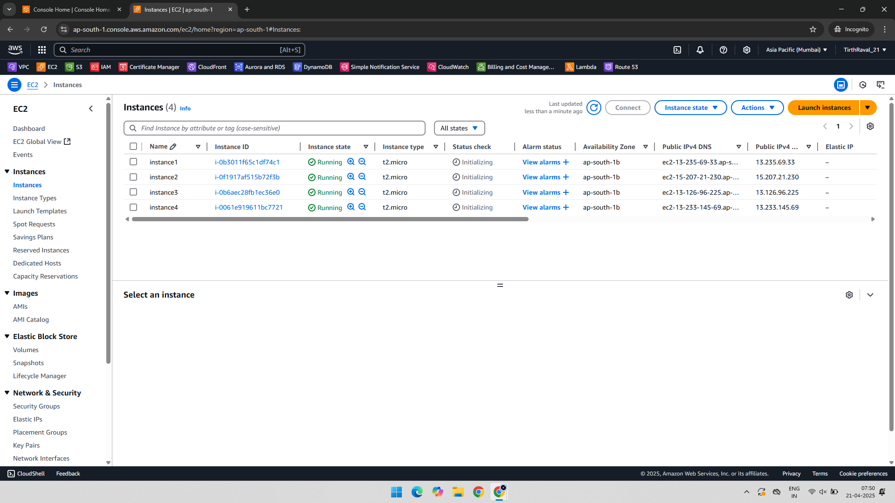

### 🎯 2. Create Target Group  
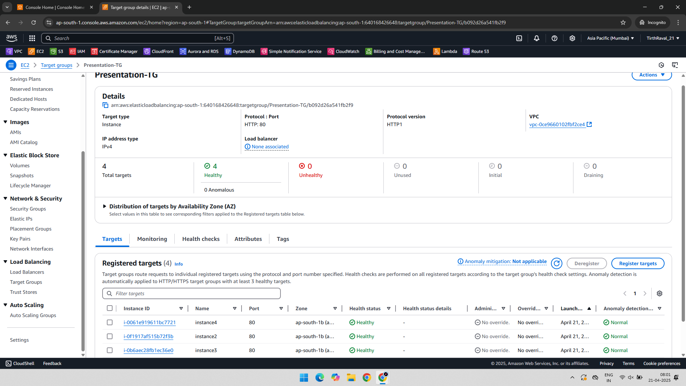

### 🌐 3. Create Load Balancer  
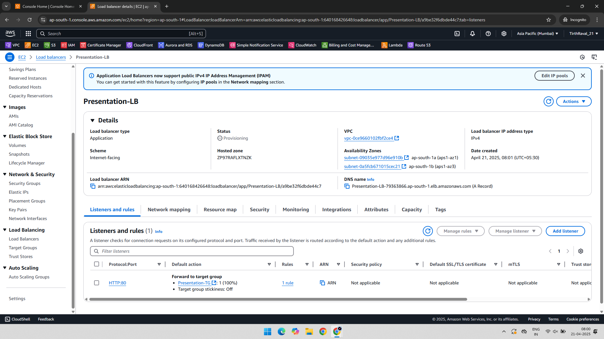

### 📈 4. Configure Auto Scaling Group  
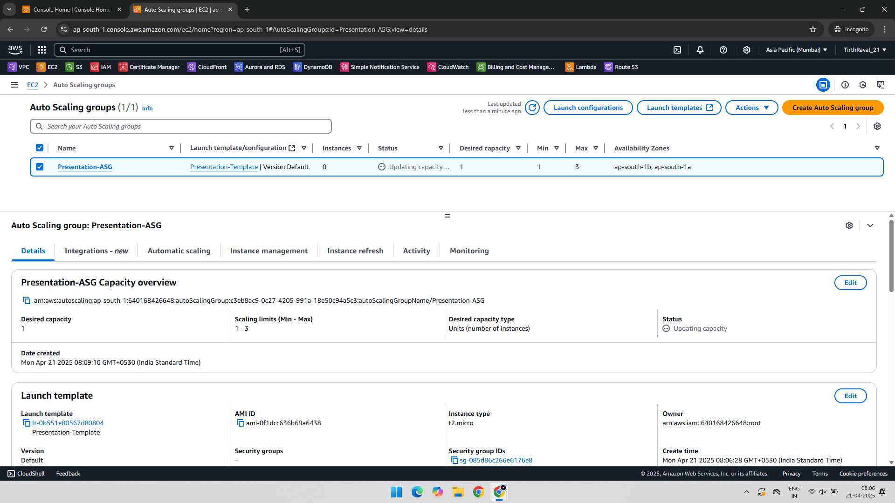

### ⚙️ 5. Target Tracking Scaling Policy  
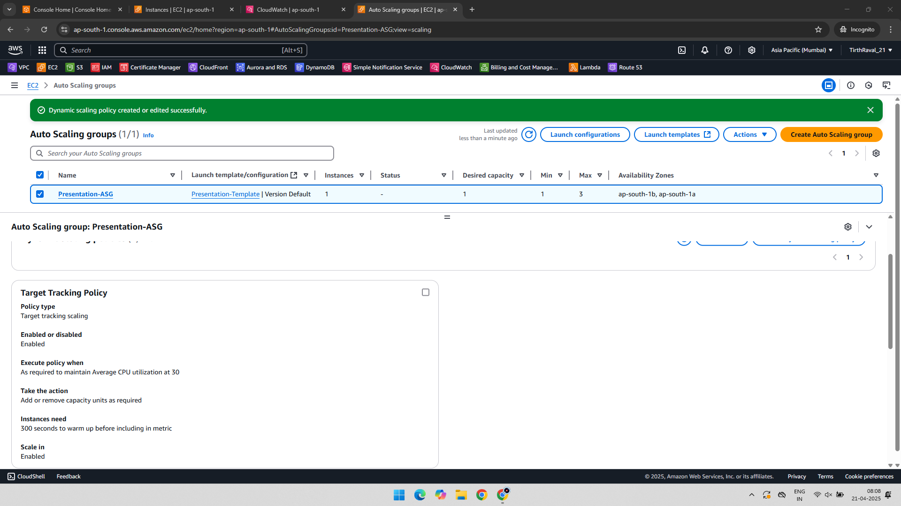

### 🧱 6. Launch Auto Scaling Instance  
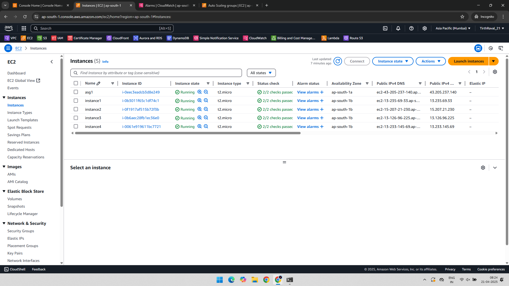

### 🔥 7. Trigger Auto Scaling by CPU Stress (via SSH)  
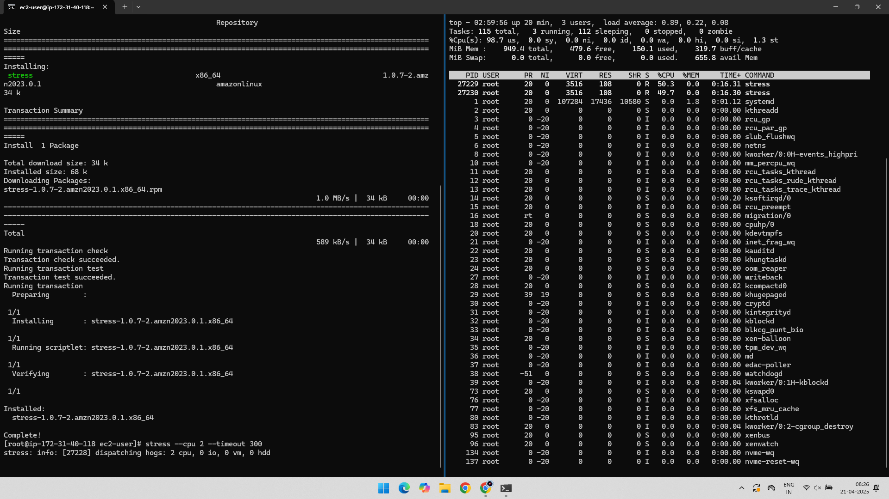

### 📊 8. Create CloudWatch Alarms for CPU Utilization  
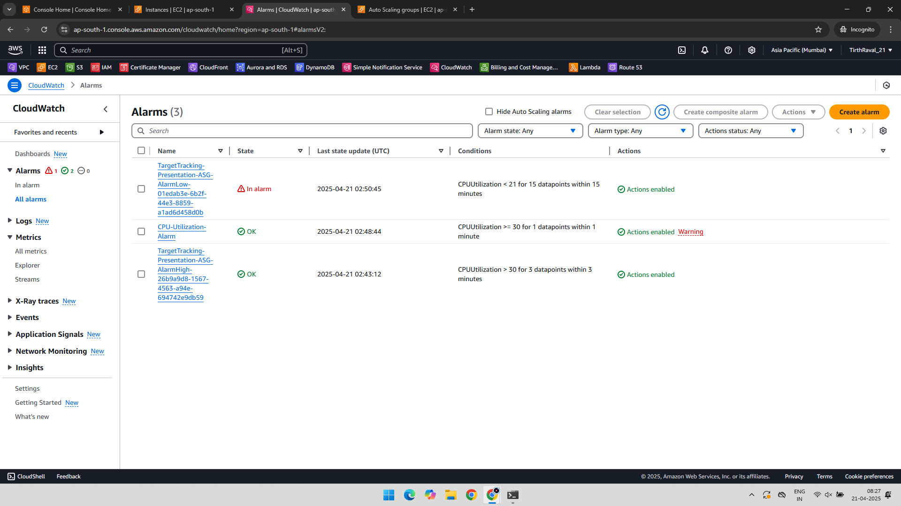

### 🚨 9. Alarm In-Alarm State  
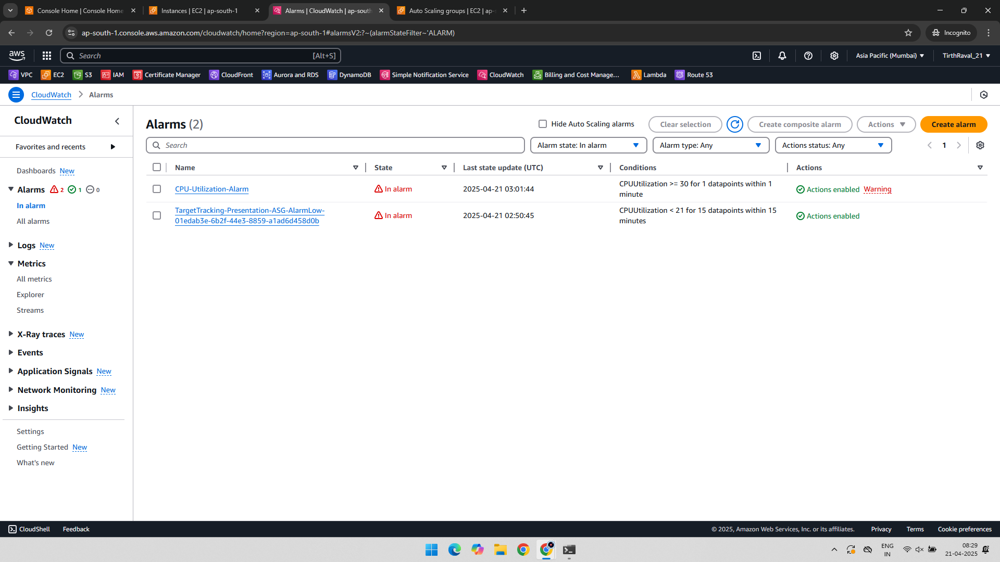

### 📉 10. CPU Utilization Graph for Alarm  
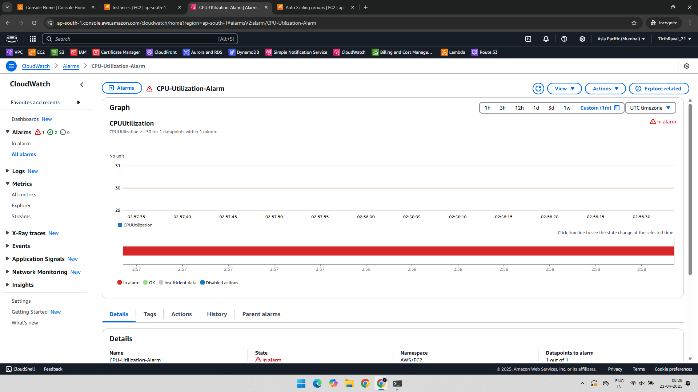

### 🚀 11. Auto Scaling Launch Triggered by Target Tracking  
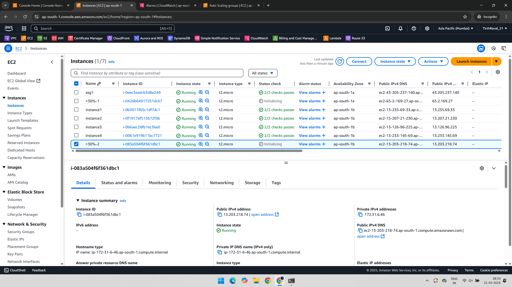

---

## ✅ Final Outcome

- Created and configured an Auto Scaling Group with policies
- Load Balancer connected to Target Group
- CloudWatch alarms triggered based on CPU usage
- Auto Scaling successfully launched a new EC2 instance

---

## 📁 Folder Structure

EC2-Project-1/
├── README.md
├── 01-EC2-Instances-Dashboard.png
├── 02-TargetGroup.png
├── 03-LoadBalancer.png
├── 04-AutoScaling.png
├── 05-Target_Tracking_Policy.png
├── 06-AutoScaling_Instance.png
├── 07-AutoScaling-Trigger-By-CPU-Stress.png
├── 08-CloudWatch-CPU-Utilization-AutoScaling-Alarms.png
├── 09-CloudWatch-CPU-Alarms-InAlarm-State.png
├── 10-CPUUtilization-Alarm-Graph-InAlarm.png
└── 11-AutoScaling-TargetTracking-InstanceLaunch.png

---

## 📌 Author

**Tirth Raval** – [GitHub](https://github.com/RavalTirth21)  
BSc IT (Architecture & Network Security) | CCNA + AWS Intern

---

