# Project 2: EC2 EBS Volume Management, Snapshot & AMI Creation

## 📘 Overview

This project demonstrates how to:
- Attach and mount an EBS volume to an EC2 instance
- Create and restore snapshots
- Unmount and delete volumes
- Create an AMI
- Use launch templates with EC2

It covers step-by-step operations with relevant screenshots for each major task in AWS.

---

## 🧰 AWS Services Used

- Amazon EC2
- Amazon EBS
- Snapshots
- AMIs
- Launch Templates
- Key Pairs
- Security Groups

---

## 🧑‍💻 Project Steps with Screenshots

### 🔐 1. Create Security Group  

### 🔑 2. Create a Key Pair  
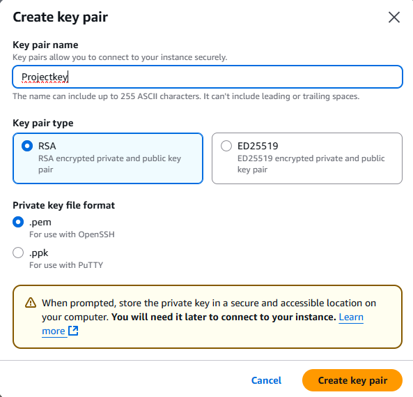

### 📜 3. Configure User Data  
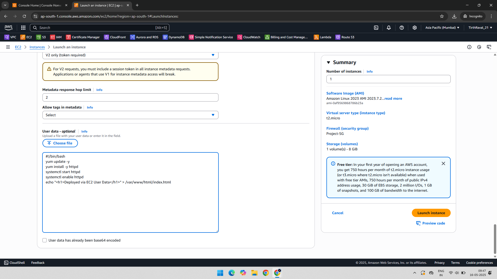

### 💻 4. Launch EC2 Instance  
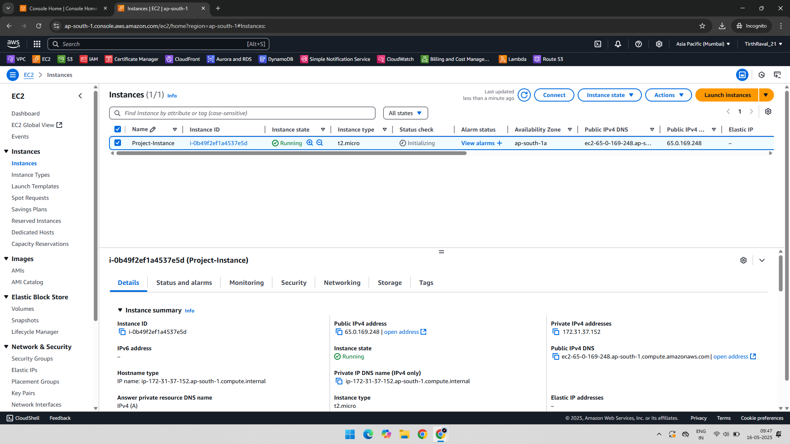

### 🌐 5. Allocate Elastic IP  
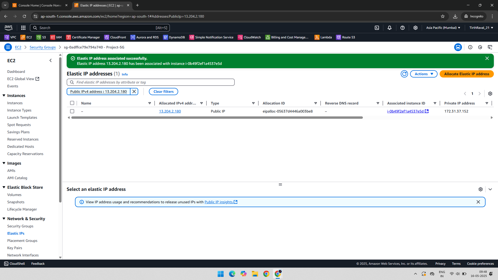

### 🔗 6. Connect to EC2 via SSH  
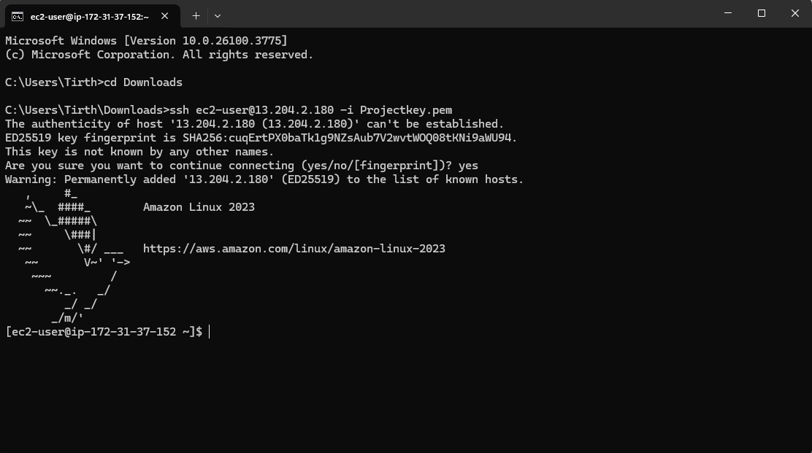

### 💽 7. Create EBS Volume  
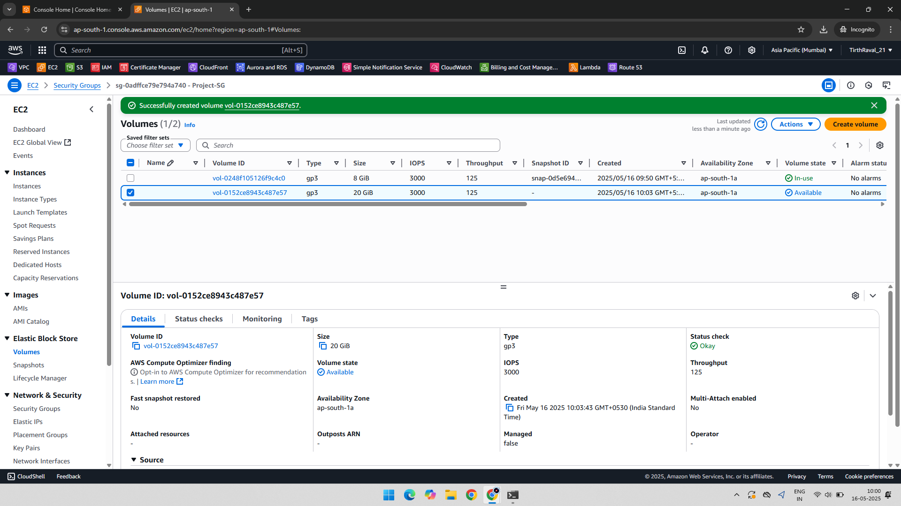

### 🔧 8. Attach EBS Volume to Instance  
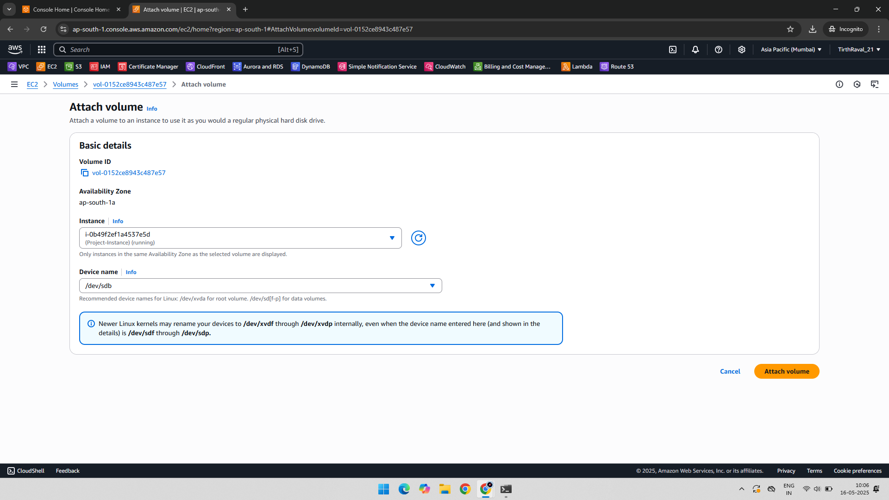

### 📁 9. Mount EBS Volume (Temporary)  
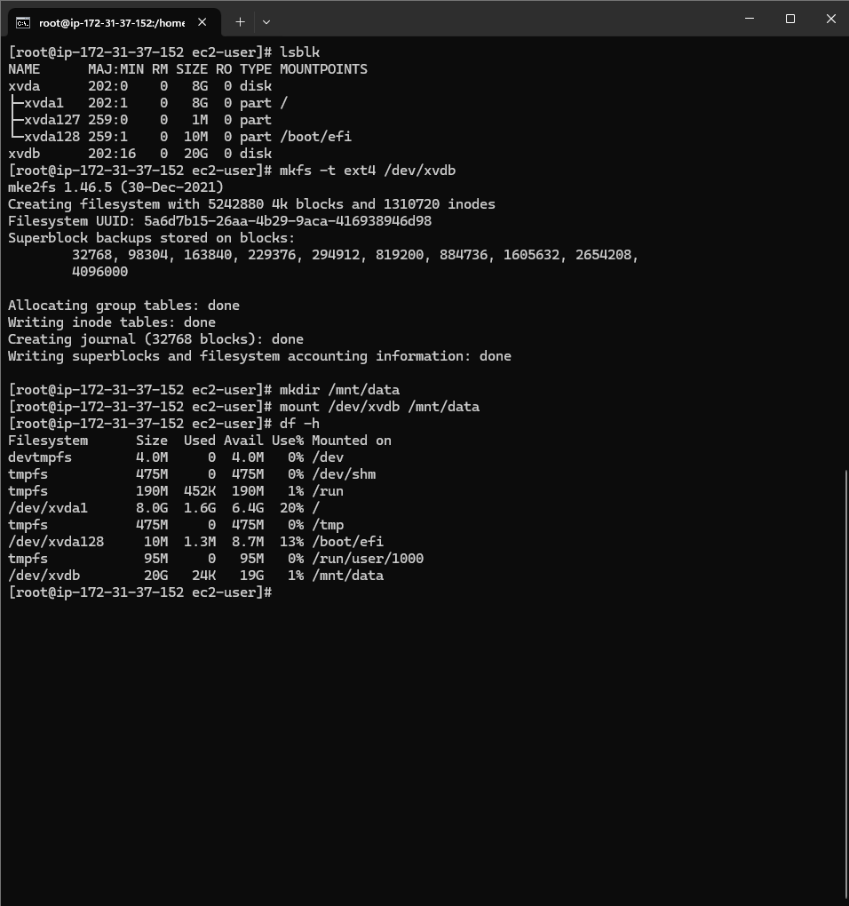

### ⚙️ 10. Add to `/etc/fstab` for Auto Mount  
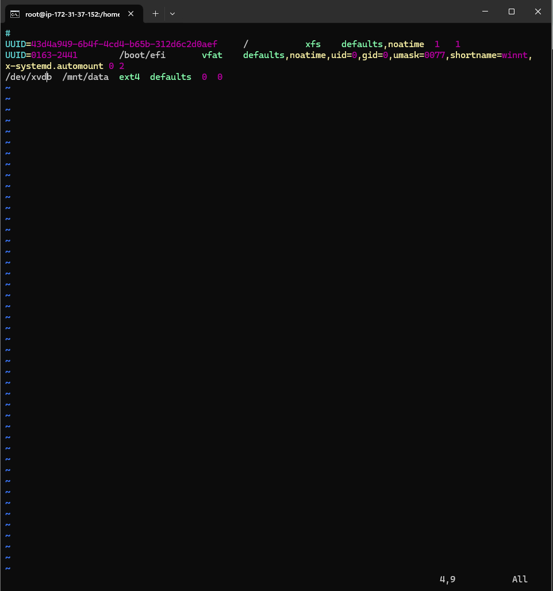

### 🧊 11. Create Snapshot of EBS Volume  
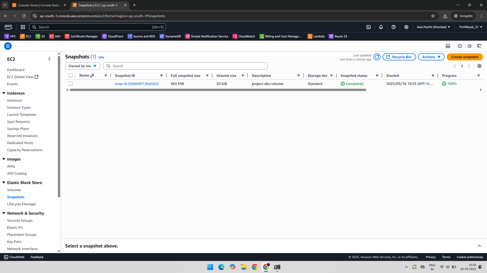

### ⏏️ 12. Unmount the EBS Volume  
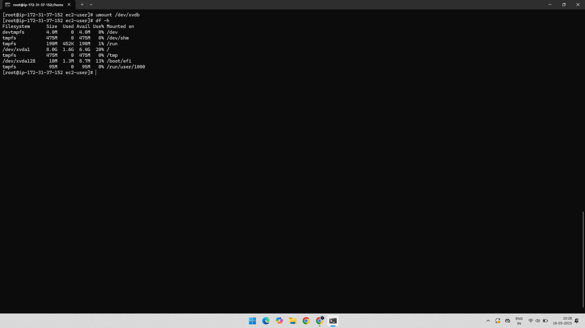

### 🗑️ 13. Delete EBS Volume  
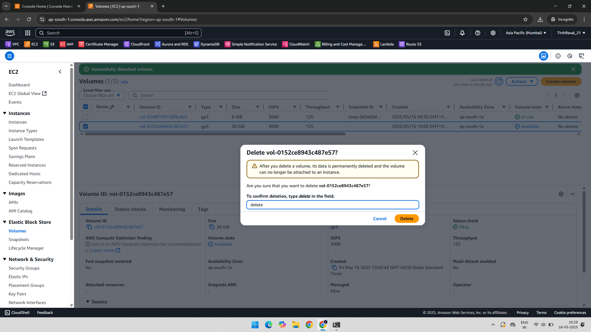

### 🔄 14. Create Volume From Snapshot  
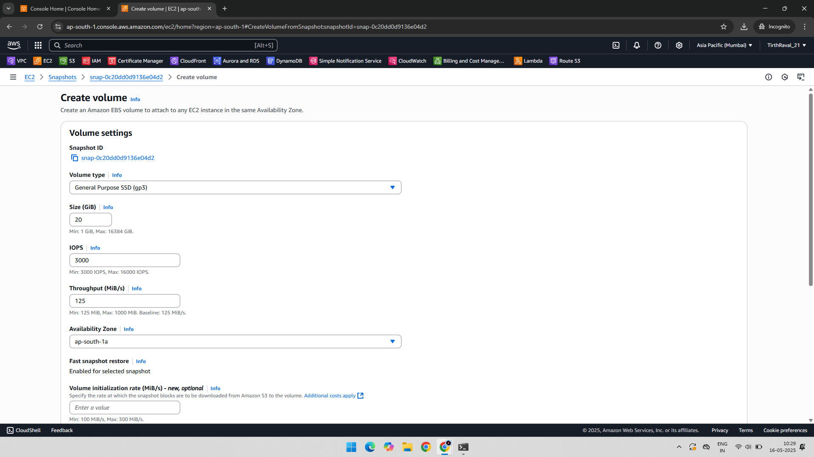

### 🔗 15. Attach Snapshot-Based Volume  

### 📁 16. Mount Snapshot Volume  
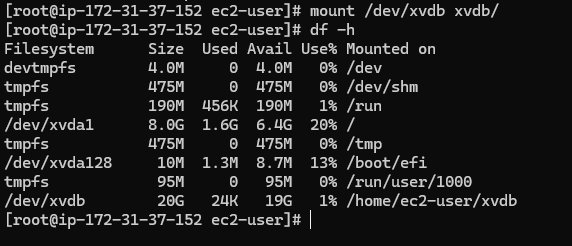

### 📄 17. Create EC2 Launch Template  
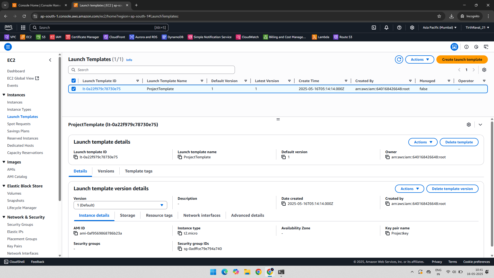

### 🧱 18. Create AMI from EC2  
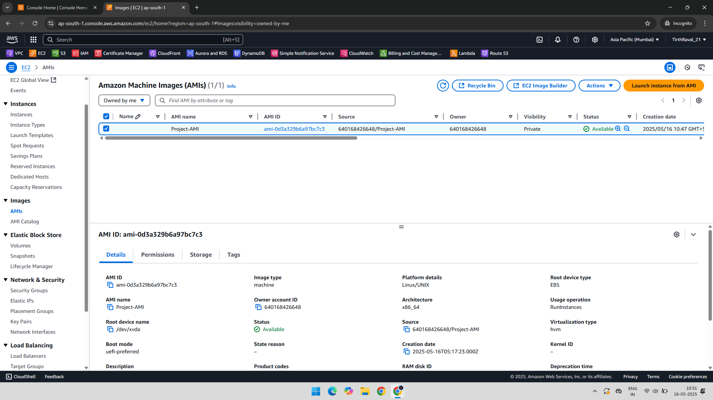

---

## ✅ Final Outcome

- Successfully mounted and managed EBS volumes
- Created and restored from snapshot
- Generated AMI and used launch template

## 📁 Folder Structure

EC2-Project-2/
├── README.md
├── 01-Security-Group-Creation.png
├── 02-KeyPair.png
├── 03-UserData.png
├── 04-InstanceCreated.png
├── 05-Elastic-IP-Allocated.png
├── 06-SSH-Configured.png
├── 07-EBS-Volume-Created.png
├── 08-Volume-Attach-Instance.png
├── 09-ec2-mount-volume-once.png
├── 10-add-ebs-volume-to-fstab.png
├── 11-Snapshot-EBS-Volume.png
├── 12-Unmount-EBS-Volume.png
├── 13-Deleted-EBS-Volume.png
├── 14-Volume-From-Snapshot.png
├── 15-Attach-Snapshot-Volume.png
├── 16-Mount-Snapshot-Volume.png
├── 17-LaunchTemplate-Creation.png
└── 18-AMI-Created.png

---

## 📌 Author

**Tirth Raval** – [GitHub](https://github.com/YOUR-USERNAME)  
BSc IT (Architecture & Network Security) | CCNA + AWS Intern

---
